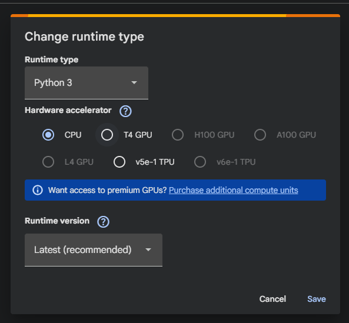
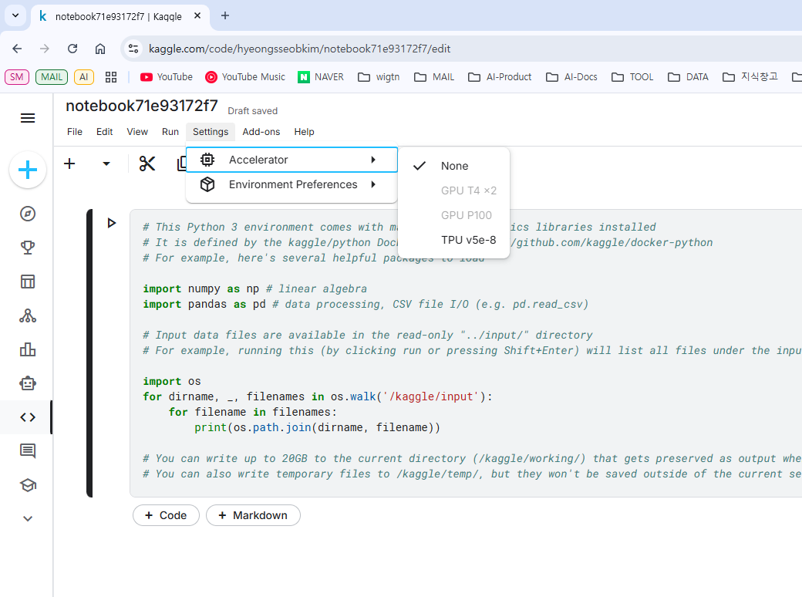

# 01. RAPIDS 실습 환경 준비하기

## 1. RAPIDS 소개

### RAPIDS란?
RAPIDS는 NVIDIA가 개발한 오픈소스 GPU 가속 데이터 분석 라이브러리다. pandas, scikit-learn과 동일한 API를 제공하여 최소한의 코드 변경으로 GPU 가속 성능을 얻을 수 있다.

### 핵심 용어
- **CUDA**: NVIDIA GPU에서 병렬 연산을 실행하기 위한 플랫폼
- **Compute Capability**: GPU의 기능 수준을 나타내는 버전 번호 (RAPIDS는 7.0 이상 필요)
- **cuDF**: GPU 가속 pandas
- **cuML**: GPU 가속 scikit-learn

### 최신 버전 정보 (2026년 1월 기준)

| 항목 | 현재 상태 |
|------|----------|
| 최신 버전 | **RAPIDS 25.12** |
| CUDA 최소 요구 | 12.2 이상 |
| Python 지원 | 3.10, 3.11, 3.12, 3.13 |
| Docker 이미지 | CUDA 메이저 버전별 단일 태그 (cuda12, cuda13) |

> **새 기능**: cuML이 scikit-learn 가속 지원, Polars GPU Engine 추가, Google Colab에 cuDF 기본 탑재

### 요구사항 요약

| 항목 | 요구사항 |
|------|----------|
| GPU | Compute Capability 7.0 이상 (RTX 20/30/40, GTX 16 시리즈) |
| 드라이버 | CUDA 12.x: 525.60+, CUDA 13.x: 580.65+ |
| OS | Linux (glibc 2.28+), WSL2 (Windows 11) |

> **참고**: Pascal (GTX 10 시리즈) 지원은 RAPIDS 24.02에서 종료되었다.

### 권장 사양

| 항목 | 권장 사양 |
|------|----------|
| GPU VRAM | 16GB 이상 |
| 시스템 메모리 | GPU VRAM의 2배 이상 (Dask 사용 시 특히 중요) |
| 저장장치 | SSD (NVMe 권장) |
| 다중 GPU | NVLink 연결 권장 |

---

## 2. 설치 방법 선택 가이드

### 어떤 방법을 선택해야 할까?

```
GPU가 있나요?
├─ 없음 → 클라우드 환경 (4장 참고)
│         ├─ Colab: 빠른 테스트, 입문자
│         └─ Kaggle: 대회 참가, T4 GPU x2
│
└─ 있음 → 로컬 환경 (5~6장 참고)
          ├─ 환경 격리 필요 → Docker (6.2)
          └─ 유연한 관리 → Conda (6.1)
```

### 클라우드 환경 비교 (GPU 없는 경우)

| 방법 | 장점 | 단점 | 추천 대상 |
|------|------|------|----------|
| **Colab** | 설치 불필요, 무료 GPU, cuDF 기본 탑재 | 세션 12시간 제한 | 입문자, 빠른 테스트 |
| **Kaggle** | 설치 불필요, T4 GPU x2 | 주당 사용 시간 제한 | 입문자, 대회 참가 |
| **AI Workbench** | GUI 환경, 자동 설정 | NVIDIA 계정 필요 | 복잡한 설정 회피 |

> **입문자 추천**: Colab → Kaggle 순서로 시작

### 로컬 환경 비교 (GPU 있는 경우)

| 방법 | 장점 | 단점 | 추천 대상 |
|------|------|------|----------|
| **Conda** | 유연한 패키지 관리, CUDA 자동 포함 | 환경 충돌 가능성 | 개인 연구, 커스터마이징 |
| **Docker** | 환경 격리, 재현성 | Docker 학습 필요 | 팀 프로젝트, 프로덕션 |
| **pip** | 기존 환경에 추가 가능 | CUDA Toolkit 별도 설치 필요 | 기존 Python 환경 활용 |

> **로컬 설치 전**: 5장에서 CUDA 환경을 먼저 설정하세요.
> **추천 순서**: Conda → Docker → pip

---

## 3. 내 환경 확인하기

### nvidia-smi 실행

터미널에서 `nvidia-smi`를 실행하면 GPU 정보를 확인할 수 있다:

```
+-----------------------------------------------------------------------------------------+
| NVIDIA-SMI 580.102.01             Driver Version: 581.57         CUDA Version: 13.0     |
|                                          ^^^^^^^^^^^^             ^^^^^^^^^^^^^^^^^^    |
|                                          (1) 드라이버 버전          (2) CUDA 버전          |
+-----------------------------------------+------------------------+----------------------+
| GPU  Name                 Persistence-M | Bus-Id          Disp.A | Volatile Uncorr. ECC |
|=========================================+========================+======================|
|   0  NVIDIA GeForce RTX 4060        On  |   00000000:01:00.0  On |                  N/A |
|      ^^^^^^^^^^^^^^^^^^^^^^^^^          |                        |                      |
|      (3) GPU 모델명                      |                        |                      |
|  0%   50C    P8            N/A  /  115W |    3419MiB /   8188MiB |      5%      Default |
|       ^^^                               |    ^^^^^^^^^^^^^^^^^^  |                      |
|       (4) 온도                           |    (5) VRAM 사용량      |                      |
+-----------------------------------------+------------------------+----------------------+
```

### 확인해야 할 항목

| 번호 | 항목 | 확인 사항 |
|------|------|----------|
| (1) | Driver Version | CUDA 12.x: 525.60+, CUDA 13.x: 580.65+ |
| (2) | CUDA Version | RAPIDS 설치 시 이 버전 이하로 지정 |
| (3) | GPU Name | RTX 20/30/40, GTX 16 시리즈면 지원 |
| (5) | VRAM | 여유 있어야 Out of Memory 방지 |

### GPU 지원 여부 빠른 확인

```bash
nvidia-smi --query-gpu=name,compute_cap --format=csv
```

출력 예시:
```
name, compute_cap
NVIDIA GeForce RTX 4060, 8.9
```

Compute Capability **7.0 이상**이면 RAPIDS 사용 가능.

### RAPIDS 지원 CUDA 버전 (2026년 1월 기준)

| CUDA 버전 | 지원 여부 | 최소 드라이버 |
|-----------|----------|--------------|
| CUDA 11.x | 지원 종료 | - |
| CUDA 12.x | 지원 | 525.60.13+ |
| CUDA 13.x | 지원 | 580.65.06+ |

> 최신 정보: https://docs.rapids.ai/install/

---

## 4. 클라우드 환경

### 4.1 Google Colab

Colab은 Google이 제공하는 무료 Jupyter Notebook 환경이다. cuDF가 기본 포함되어 있다.

**GPU 런타임 설정:**
1. 상단 **런타임** → **런타임 유형 변경**
2. **T4 GPU** 선택 후 저장



**RAPIDS 사용:**
```python
# cuDF는 기본 설치됨
import cudf
gdf = cudf.DataFrame({"a": [1, 2, 3], "b": [4, 5, 6]})
print(gdf)
```

**cuML 등 추가 라이브러리 설치:**
```python
!git clone https://github.com/rapidsai/rapidsai-csp-utils.git
!python rapidsai-csp-utils/colab/pip-install.py
```

```python
from cuml.linear_model import LinearRegression
# 이제 cuML 사용 가능
```

### 4.2 Kaggle

[Kaggle Notebook](https://www.kaggle.com/code)에는 RAPIDS가 기본 포함되어 있다.

**GPU 설정:**
1. 상단 **Settings** → **Accelerator** → **GPU T4 x2** 선택



**GPU T4 옵션이 비활성화된 경우:**
- **휴대폰 인증 미완료**: 프로필 → Settings → Phone Verification 완료
- **주간 할당량 소진**: 주 30시간 제공, 매주 토요일 09:00(KST) 초기화
- **다른 GPU 세션 실행 중**: Active Events에서 기존 세션 종료
- **브라우저 간섭**: 광고 차단기 끄거나 시크릿 모드로 접속

**RAPIDS 사용:**
```python
import cudf
cudf.__version__
```

> 최신 버전 사용: Settings → Environment → "Always use latest environment"

### 4.3 NVIDIA AI Workbench

NVIDIA AI Workbench는 복잡한 환경 설정을 단일 플랫폼으로 간소화하는 도구다.

- 공식 문서: https://docs.nvidia.com/workbench/
- 요구사항: WSL (Windows), Docker, NVIDIA 계정

> 상세 설정은 공식 문서 참고

---

## 5. 로컬 환경 준비

로컬에서 RAPIDS를 사용하려면 NVIDIA 드라이버 설정이 필요하다.

> **핵심**: RAPIDS를 Conda로 설치하면 CUDA Toolkit이 자동 포함된다. 드라이버만 설치하면 된다.

### 5.1 Windows 사용자 (WSL2 필수)

Windows에서 RAPIDS를 사용하려면 **WSL2가 필수**다. RAPIDS는 Linux에서만 동작한다.

#### 필수 요구사항

| 항목 | 요구사항 |
|------|----------|
| Windows 버전 | Windows 10 (빌드 19041+) 또는 Windows 11 |
| WSL 버전 | WSL2 필수 (WSL1 미지원) |
| GPU | Compute Capability 7.0 이상 |

#### Step 1: Windows에 NVIDIA 드라이버 설치

> **중요**: WSL2는 Windows 드라이버를 공유한다. WSL 내부에 드라이버를 설치하면 안 된다.

1. [NVIDIA 드라이버 다운로드](https://www.nvidia.com/download/index.aspx)에서 **Windows용** 드라이버 설치
2. Game Ready 또는 Studio 드라이버 모두 가능
3. 설치 후 재부팅

#### Step 2: WSL2 설치

**방법 1**: PowerShell (관리자) - 권장
```powershell
wsl --install Ubuntu-22.04
wsl --set-default-version 2
wsl --update
```

**방법 2**: 수동 설치
1. **제어판** → **프로그램** → **Windows 기능 켜기/끄기**
2. 체크: ✅ Linux용 Windows 하위 시스템, ✅ 가상 머신 플랫폼
3. 재부팅 후 Microsoft Store에서 Ubuntu 설치

#### Step 3: WSL에서 GPU 인식 확인

```bash
# WSL 터미널에서
nvidia-smi
```

GPU 정보가 표시되면 정상. 이후 **6장**에서 RAPIDS 설치 진행.

#### (선택) WSL에서 CUDA Toolkit 설치

> Conda로 RAPIDS 설치 시 불필요. pip 설치 시에만 필요.

```bash
wget https://developer.download.nvidia.com/compute/cuda/repos/wsl-ubuntu/x86_64/cuda-keyring_1.1-1_all.deb
sudo dpkg -i cuda-keyring_1.1-1_all.deb
sudo apt update
sudo apt install cuda-toolkit-12-5
```

#### WSL2 제한사항

| 제한 | 설명 |
|------|------|
| 다중 GPU | 단일 GPU만 지원 |
| GPU Direct Storage | 미지원 |

### 5.2 Linux/Ubuntu 사용자

#### Step 1: NVIDIA 드라이버 설치

**방법 1**: 자동 설치 (권장)
```bash
ubuntu-drivers devices          # 권장 드라이버 확인
sudo ubuntu-drivers autoinstall # 자동 설치
sudo reboot
```

**방법 2**: 수동 설치
```bash
sudo apt update
sudo apt install nvidia-driver-535
sudo reboot
```

#### Step 2: 드라이버 확인

```bash
nvidia-smi
```

GPU 정보가 표시되면 정상. 이후 **6장**에서 RAPIDS 설치 진행.

#### (선택) CUDA Toolkit 설치

> Conda로 RAPIDS 설치 시 불필요. pip 설치 시에만 필요.

```bash
# Ubuntu 22.04 예시
wget https://developer.download.nvidia.com/compute/cuda/repos/ubuntu2204/x86_64/cuda-keyring_1.1-1_all.deb
sudo dpkg -i cuda-keyring_1.1-1_all.deb
sudo apt update
sudo apt install cuda-toolkit-12-5
```

환경 변수 설정 (`~/.bashrc`에 추가):
```bash
export PATH=/usr/local/cuda/bin:$PATH
export LD_LIBRARY_PATH=/usr/local/cuda/lib64:$LD_LIBRARY_PATH
```

---

## 6. RAPIDS 설치

### 6.1 Conda로 설치 (권장)

#### 이미 Conda가 설치되어 있다면?

기존 Anaconda/Miniconda 사용자는 바로 **RAPIDS 환경 생성** 단계로 이동.

> **주의**: defaults 채널 문제 방지를 위해 `-c nodefaults` 추가 권장

```bash
conda create -n rapids-25.12 \
    -c rapidsai -c conda-forge -c nvidia -c nodefaults \
    rapids=25.12 python=3.12 cuda-version=12.5 -y
```

#### Conda가 없다면? → Miniforge 설치

> **왜 Miniforge?**: conda-forge 기본 채널, defaults 채널 문제 없음, libmamba 솔버 포함 (빠름)

**Step 1: Miniforge 다운로드**

```bash
cd /tmp
wget "https://github.com/conda-forge/miniforge/releases/latest/download/Miniforge3-$(uname)-$(uname -m).sh" -O miniforge.sh
```

**Step 2: Miniforge 설치**

```bash
bash miniforge.sh -b -p ~/miniforge3
```

**Step 3: Conda 초기화 및 활성화**

```bash
~/miniforge3/bin/conda init bash
source ~/.bashrc  # 또는 새 터미널 열기
```

#### RAPIDS 환경 생성

본인 환경에 맞게 `cuda-version`을 수정:

```bash
conda create -n rapids-25.12 \
    -c rapidsai -c conda-forge -c nvidia \
    rapids=25.12 python=3.12 cuda-version=12.5 -y
```

> **Tip**: mamba를 사용하면 더 빠르게 설치할 수 있다: `mamba create -n rapids-25.12 ...`

**옵션 설명:**

| 옵션 | 설명 |
|------|------|
| `-n rapids-25.12` | 환경 이름 |
| `-c rapidsai -c conda-forge -c nvidia` | 패키지 채널 |
| `rapids=25.12` | RAPIDS 버전 |
| `python=3.12` | Python 버전 (3.10~3.13 지원) |
| `cuda-version=12.5` | nvidia-smi에서 확인한 버전 이하로 지정 |
| `-y` | 확인 프롬프트 자동 승인 |

#### Step 6: 환경 활성화

```bash
conda activate rapids-25.12
```

프롬프트 앞에 `(rapids-25.12)`가 표시되면 정상.

#### Step 7: 설치 확인

```bash
python -c "import cudf; print('cuDF:', cudf.__version__)"
python -c "import cuml; print('cuML:', cuml.__version__)"
```

출력 예시:
```
cuDF: 25.12.00
cuML: 25.12.00
```

#### 시각화 라이브러리 추가 (선택)

```bash
conda install -n rapids-25.12 -c conda-forge matplotlib seaborn
```

### 6.2 Docker로 설치

Docker를 사용하면 환경 충돌 없이 RAPIDS를 사용할 수 있다.

#### 요구사항
- Docker 설치
- NVIDIA Container Toolkit 설치
- NVIDIA GPU 드라이버

#### RAPIDS 컨테이너 실행

```bash
# 이미지 다운로드 및 실행 (CUDA 12 환경)
docker run --gpus all -it -p 8888:8888 \
    rapidsai/base:25.12-cuda12-py3.12

# CUDA 13 환경
docker run --gpus all -it -p 8888:8888 \
    rapidsai/base:25.12-cuda13-py3.13
```

> **참고**: RAPIDS 25.10부터 Docker 이미지 태그가 CUDA 메이저 버전별로 통합됨 (cuda12, cuda13)

#### 로컬 디렉토리 마운트

```bash
docker run --gpus all -it -p 8888:8888 \
    -v $(pwd):/rapids/notebooks/host \
    rapidsai/base:25.12-cuda12-py3.12
```

| 옵션 | 설명 |
|------|------|
| `--gpus all` | 모든 GPU 사용 |
| `-p 8888:8888` | Jupyter Lab 포트 |
| `-v $(pwd):...` | 현재 디렉토리 마운트 |

> **참고**: base 이미지는 기본적으로 ipython 셸로 시작된다. bash로 시작하려면 명령 끝에 `/bin/bash`를 추가.

### 6.3 pip으로 설치

pip으로도 RAPIDS를 설치할 수 있다. 단, 시스템에 CUDA Toolkit이 설치되어 있어야 한다.

#### 요구사항

- Python 3.10, 3.11, 3.12, 3.13
- CUDA Toolkit 12.x 또는 13.x 설치됨
- NVRTC 포함 (Docker 사용 시 `devel` 이미지 필요)

#### 설치

```bash
# CUDA 12 환경
pip install --extra-index-url=https://pypi.nvidia.com \
    cudf-cu12==25.12.* cuml-cu12==25.12.* cugraph-cu12==25.12.*

# CUDA 13 환경
pip install --extra-index-url=https://pypi.nvidia.com \
    cudf-cu13==25.12.* cuml-cu13==25.12.* cugraph-cu13==25.12.*
```

> **주의**: `-cu12` 또는 `-cu13` 접미사는 시스템에 설치된 CUDA Toolkit 버전과 일치해야 한다.

#### 제한사항

| 제한 | 설명 |
|------|------|
| TensorFlow | pip 버전과 호환 안 됨 (NGC 컨테이너 또는 Conda 사용) |
| Infiniband | 미지원 |
| NVRTC | 필수 (Docker는 `devel` 이미지 사용) |

#### 설치 확인

```python
import cudf
print(cudf.Series([1, 2, 3]))
```

---

## 7. Quick Reference

### 환경 확인

```bash
nvidia-smi                    # GPU 및 드라이버 확인
nvcc --version                # CUDA Toolkit 버전
python -c "import cudf; print(cudf.__version__)"  # RAPIDS 버전
```

### Conda 환경 관리

```bash
conda create -n [이름] [패키지]    # 환경 생성
conda activate [환경명]           # 환경 활성화
conda deactivate                 # 환경 비활성화
conda env list                   # 환경 목록
```

### RAPIDS 설치 (한 줄)

```bash
conda create -n rapids-25.12 -c rapidsai -c conda-forge -c nvidia rapids=25.12 python=3.12 cuda-version=12.5 -y
```

---

## 8. FAQ & 문제 해결

### 8.1 일반

#### Q: nvidia-smi 실행 안 됨
**원인**: NVIDIA 드라이버 미설치
**해결**: https://www.nvidia.com/download/index.aspx 에서 드라이버 설치

#### Q: nvcc --version 실행 안 됨
**원인**: CUDA Toolkit 미설치 또는 PATH 미설정
**해결**: `~/.bashrc`에 추가:
```bash
export PATH=/usr/local/cuda/bin:$PATH
export LD_LIBRARY_PATH=/usr/local/cuda/lib64:$LD_LIBRARY_PATH
```

#### Q: Out of Memory 에러
**원인**: GPU VRAM 부족
**해결**:
- 배치 크기 줄이기
- `nvidia-smi`로 다른 프로세스 확인 후 종료

### 8.2 Conda 트러블슈팅

#### Q: conda create 에러 발생
**원인**: Conda 버전이 오래됨
**해결**:
```bash
# Conda 업데이트 (23.10 이상 필요)
conda update -n base conda

# 또는 mamba 사용
mamba create -n rapids-25.12 ...
```

#### Q: `__cuda` constraint conflict 에러
```
LibMambaUnsatisfiableError: Encountered problems while solving:
 - package cuda-version-12.0 has constraint __cuda >=12 conflicting with __cuda-11.8-0
```

**원인**: 시스템 CUDA 드라이버와 설치하려는 cuda-version 불일치
**해결**:
1. `nvidia-smi`로 드라이버가 지원하는 CUDA 버전 확인
2. 해당 버전 이하로 `cuda-version` 지정
3. 또는 환경변수로 오버라이드:
```bash
CONDA_OVERRIDE_CUDA=12.5 conda create -n rapids ...
```

#### Q: 환경은 생성되지만 동작 안 함
**원인**: `defaults` 채널에서 패키지가 설치됨
**해결**:
```bash
# 현재 환경의 채널 확인
conda list

# defaults 채널 패키지가 있으면 환경 재생성
conda create -n rapids-25.12 \
    -c rapidsai -c conda-forge -c nvidia -c nodefaults \
    rapids=25.12 python=3.12 cuda-version=12.5
```

> **참고**: Miniforge 사용 시 defaults 채널이 기본 제외되어 이 문제가 발생하지 않는다.

### 8.3 Docker 트러블슈팅

#### Q: Docker 이미지 변경사항 (RAPIDS 23.08+)
- 모든 이미지가 Ubuntu 기반 (CUDA 12.5+는 Ubuntu 24.04)
- base 이미지는 **ipython 셸**로 시작됨
- bash 명령 실행 방법:
```bash
# ipython 내에서 bash 명령 실행
!nvidia-smi

# 또는 bash로 직접 시작
docker run --gpus all -it rapidsai/base:25.12-cuda12-py3.12 /bin/bash
```

#### Q: Multi-GPU 환경 설정
```bash
docker run -t -d --gpus all \
    --shm-size=1g \
    --ulimit memlock=-1 \
    --ulimit stack=67108864 \
    -v $PWD:/ws \
    rapidsai/base:25.12-cuda12-py3.12
```

### 8.4 pip 트러블슈팅

#### Q: cudf-cu12 패키지를 찾을 수 없음
```
ERROR: Could not find a version that satisfies the requirement cudf-cu12
```

**해결**:
1. Python 버전 확인 (3.10, 3.11, 3.12, 3.13 지원)
```bash
python --version
```
2. NVIDIA 패키지 인덱스 추가 확인:
```bash
pip install cudf-cu12==25.12.* --extra-index-url=https://pypi.nvidia.com
```

#### Q: TensorFlow와 함께 사용 불가
**원인**: RAPIDS pip 패키지는 TensorFlow pip 패키지와 호환 안 됨
**해결**: NGC 컨테이너 또는 Conda 사용

### 8.5 WSL2 트러블슈팅

#### Q: WSL에서 GPU 인식 안 됨
**원인**: WSL1 사용 또는 드라이버 문제
**해결**:
```bash
# WSL 버전 확인
wsl -l -v

# WSL2로 변환
wsl --set-version Ubuntu-22.04 2
```

> **중요**: WSL 내부에 NVIDIA 드라이버를 설치하면 안 된다. Windows에 설치된 드라이버를 사용해야 한다.

#### Q: Conda 설치 시 http 000 연결 에러
**해결**:
```powershell
# PowerShell에서
wsl --shutdown
# WSL 다시 시작
```

#### Q: `libcuda.so: cannot open shared object file` 에러
**해결**: [WSL GitHub Issue](https://github.com/microsoft/WSL/issues) 참고하여 해결

#### WSL2 제한사항

| 제한 | 설명 |
|------|------|
| 다중 GPU | 단일 GPU만 지원 |
| GPU Direct Storage | 미지원 |

---

## 9. 주요 변경사항 (버전별)

RAPIDS 버전 업그레이드 시 주의해야 할 주요 변경사항이다.

### 플랫폼 지원 변경

| 버전 | 변경사항 | 영향 |
|------|----------|------|
| v25.12 | CUDA 최소 요구사항 12.0 → 12.2 | CUDA 12.0/12.1 사용자는 업그레이드 필요 |
| v25.10 | Docker 이미지 CUDA 메이저 버전별 단일 태그로 통합 | 이미지 태그 변경 확인 필요 |
| v25.08 | CUDA 11 지원 완전 종료 | CUDA 11 사용자는 12.x로 업그레이드 필수 |
| v24.10 | Python 3.9 지원 종료, 3.12 추가 | Python 버전 업그레이드 필요 |
| v24.02 | Pascal GPU (GTX 10 시리즈) 지원 종료 | Compute Capability 7.0+ 필수 |

### 라이브러리 폐기/변경

| 버전 | 변경사항 | 대안 |
|------|----------|------|
| v26.02 | rapidsai/miniforge-cuda Docker 이미지 폐기 예정 | 공식 base 이미지 사용 |
| v25.12 | cuGraph-Service 패키지 배포 중단 | - |
| v25.10 | UCX-Py 프로젝트 종료 | - |
| v25.10 | pynvjitlink 종료 | - |
| v25.08 | cuGraph-DGL 패키지 배포 중단 | - |
| v25.06 | cuSpatial 패키지 배포 중단 | - |
| v25.04 | cuml-cpu 폐기 | `cuml.accel` 사용 |

### Docker 이미지 변경 (v25.08+)

| 변경사항 | 내용 |
|----------|------|
| CUDA 버전 | 12.8 → 12.9로 교체 |
| 기본 OS | CUDA 12.5+는 Ubuntu 24.04 |
| 기본 셸 | ipython (bash 아님) |

> 최신 공지사항: https://docs.rapids.ai/notices/

---

## 추가 자료

- [RAPIDS 공식 문서](https://docs.rapids.ai/)
- [RAPIDS GitHub](https://github.com/rapidsai)
- [NVIDIA Developer Forums](https://forums.developer.nvidia.com/)
